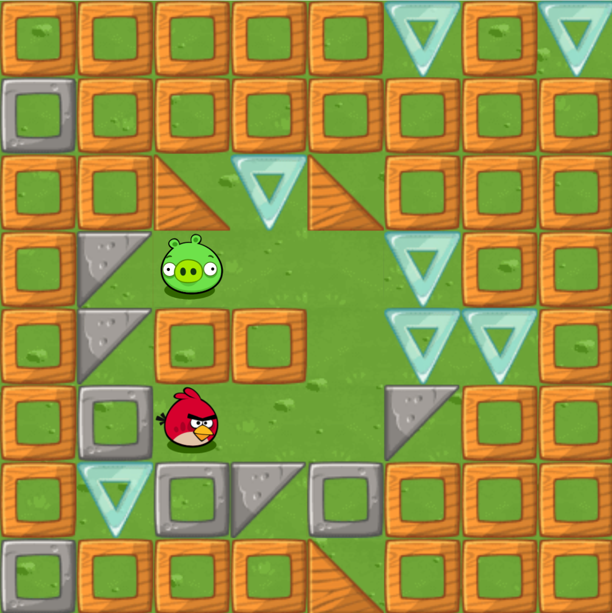
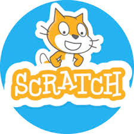
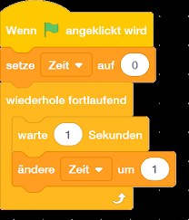
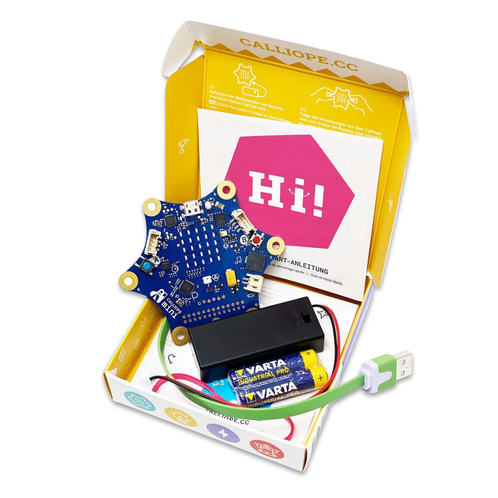
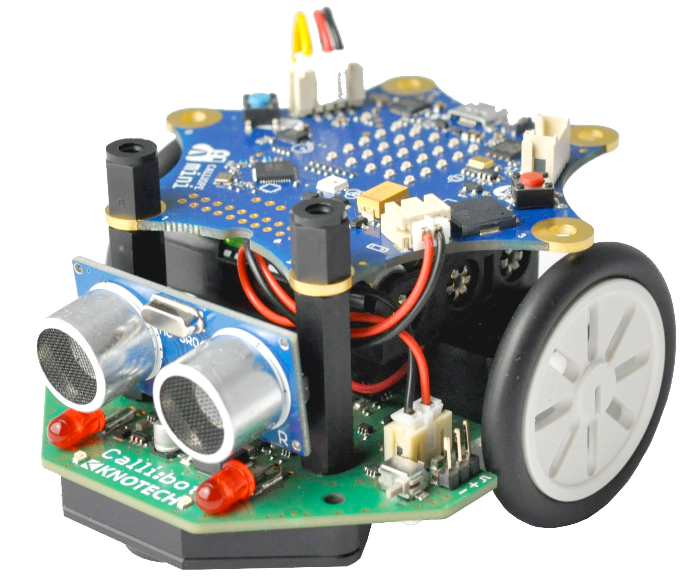

= Kids-Code
:experimental:
:figure-caption: Abbildung
:icons: image

== Wochenübersicht

[cols="1,3,2"]
|===
| KW | | Hinweise

| 44
a|
- xref:#woche-1-themen[Themen]
- xref:#woche-1-ha[Hausaufgaben]

|

| 45
a|
- xref:#woche-2-themen[Themen]
- xref:#woche-2-ha[Hausaufgaben]

a|
- xref:#woche-1-ha[HA bis heute]

| 46
|
|

| 47
|
|

| 48
|
|

| 49
|
|

| 50
|
|

| 51
|
|

| 02
|
|

| 03
|
|

| 04
|
|

| 05
|
|

| 06
|
|

| 09
|
|

| 10
|
|

| 11
|
|

| 12
|
|

| 13
|
|

| 14
|
|

| 16
|
|

| 17
|
|

| 18
|
|

| 19
|
|

| 20
|
|

| 21
|
|

| 22
|
|

| 23
|
|

| 24
|
|

| 25
|
|

| 26
|
|

|===

[#woche-1]
== Woche 1

[#woche-1-themen]
=== Themen

- Kennenlernen
- xref:_unsere_projekte[An diesen Projekten werden wir arbeiten ...]
- Roboter-Mensch programmieren
- Wir programmieren wütende Vögel

[#woche-1-ha]
=== Hausaufgaben

Erstellt ein Programm, das den Vogel zum Ziel bring:

Schreibe das Programm hier auf:

1. [.underline]#_vorwärts                         _#
2. [.underline]#                                          #
3. [.underline]#                                          #
4. [.underline]#                                          #
5. [.underline]#                                          #
6. [.underline]#                                          #
7. [.underline]#                                          #
8. [.underline]#                                          #
9. [.underline]#                                          #

[#woche-2]
== Woche 2

[#woche-2-themen]
=== Themen

[#woche-2-ha]
=== Hausaufgaben

== Unsere Projekte

=== Menschlicher Roboter

=== Programmieren mit Angry Birds & Co.

=== Programmieren mit Scratch

=== Programmieren mit Calliope

=== Programmieren mit Calli:bot

